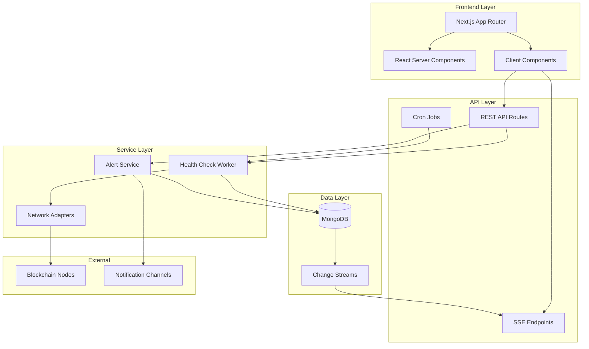
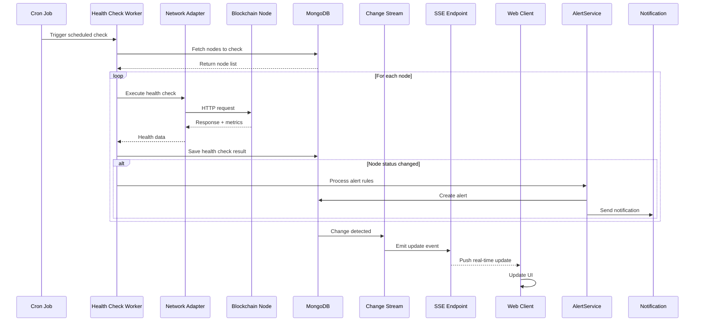
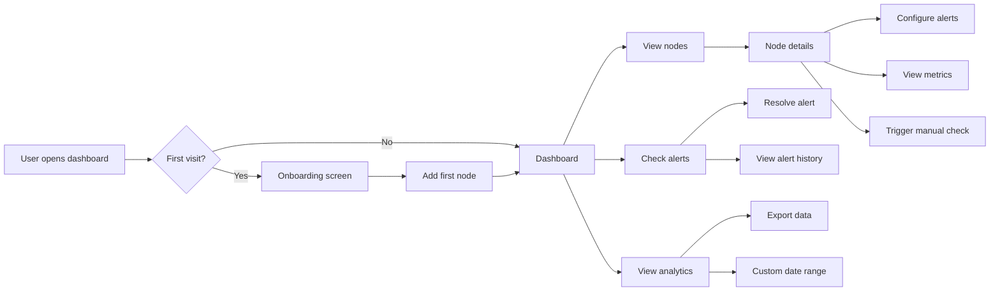
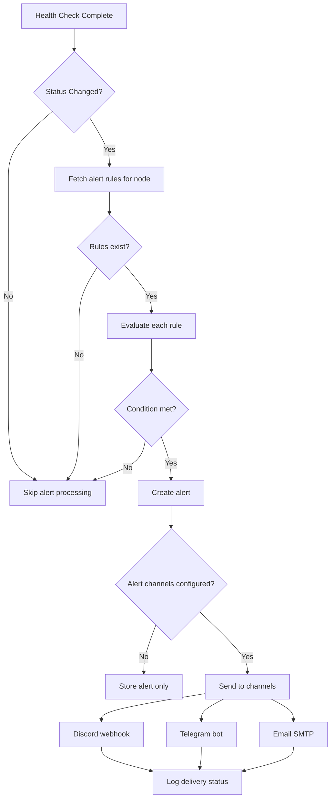

# NodePulse

> **Self-hosted monitoring for DePIN nodes built with Next.js and TypeScript**

NodePulse is a comprehensive monitoring dashboard for decentralized physical infrastructure network (DePIN) operators. Monitor multiple blockchain nodes, receive real-time alerts, and gain insights into your infrastructure health—all from a unified, type-safe interface.

[](https://nextjs.org/)
[](https://www.typescriptlang.org/)
[](https://www.mongodb.com/)
[](https://www.docker.com/)

---

## 📋 Table of Contents

- [Overview](#overview)
- [Features](#features)
- [Architecture](#architecture)
- [Project Structure](#project-structure)
- [Data Flow](#data-flow)
- [Getting Started](#getting-started)
- [Configuration](#configuration)
- [Deployment](#deployment)
- [API Documentation](#api-documentation)
- [Development](#development)
- [Contributing](#contributing)

---

## 🎯 Overview

### Problem Statement

DePIN node operators face significant challenges:

- **Fragmented Monitoring**: Managing multiple nodes across different networks requires separate tools
- **Reactive Operations**: Issues are discovered after revenue loss occurs
- **Privacy Concerns**: Cloud-based solutions expose sensitive operational data
- **Maintenance Overhead**: Complex setups with poor type safety and documentation

### Solution

NodePulse provides:

- ✅ **Unified Dashboard**: Monitor Helium, Render, Arweave, and custom nodes from one interface
- ✅ **Real-time Alerts**: Proactive notifications via Discord, Telegram, and webhooks
- ✅ **Self-hosted**: Complete data ownership and privacy
- ✅ **Type-safe**: Full TypeScript implementation for reliability
- ✅ **Easy Deployment**: One-click Docker deployment via NodeOps marketplace

---

## ✨ Features

### Core Capabilities

🔍 **Multi-Network Support**
- Pre-built adapters for Helium, Render, and Arweave
- Generic HTTP adapter for custom blockchain nodes
- Extensible adapter architecture

📊 **Real-time Monitoring**
- Live health status updates via Server-Sent Events (SSE)
- Response time tracking with historical trends
- Resource utilization metrics (CPU, memory, disk)
- Network-specific metrics (sync status, rewards, etc.)

🚨 **Intelligent Alerting**
- Configurable alert rules per node
- Multiple severity levels (info, warning, critical)
- Multi-channel notifications (Discord, Telegram, Email)
- Alert history and resolution tracking

📈 **Analytics & Insights**
- Historical health check data
- Performance trend visualization
- Uptime percentage calculations
- Custom metric dashboards

---

## 🏗️ Architecture

### High-Level Architecture



### Technology Stack

**Core Framework**
- **Next.js 16** with App Router
- **React 19** with Server Components
- **TypeScript 5.x** for full-stack type safety

**Database & ORM**
- **MongoDB** for flexible document storage
- **Mongoose ODM** with TypeScript support

**Styling & UI**
- **Tailwind CSS** for utility-first styling
- **shadcn/ui** for accessible components
- **Lucide React** for icons

**Real-time Features**
- **Server-Sent Events (SSE)** for live updates
- **MongoDB Change Streams** for reactivity
- **React Query/TanStack Query** for client state

---

## 📁 Project Structure

```
nodepulse/
├── app/                                # Next.js App Router
│   ├── (auth)/                         # Authentication routes (future)
│   │   ├── layout.tsx
│   │   └── login/
│   │       └── page.tsx
│   │
│   ├── (dashboard)/                    # Main dashboard layout
│   │   ├── layout.tsx                  # Sidebar + Header wrapper
│   │   ├── page.tsx                    # Dashboard home
│   │   ├── nodes/                      # Node management
│   │   │   ├── page.tsx                # Nodes list
│   │   │   ├── new/page.tsx            # Add node
│   │   │   └── [id]/                   # Node details
│   │   │       ├── page.tsx
│   │   │       ├── metrics/page.tsx
│   │   │       └── settings/page.tsx
│   │   ├── alerts/                     # Alert management
│   │   │   ├── page.tsx
│   │   │   └── [id]/page.tsx
│   │   ├── analytics/                  # Historical data
│   │   │   └── page.tsx
│   │   └── settings/                   # App settings
│   │       ├── page.tsx
│   │       ├── notifications/page.tsx
│   │       └── integrations/page.tsx
│   │
│   ├── api/                            # API routes
│   │   ├── nodes/
│   │   │   ├── route.ts                # GET, POST nodes
│   │   │   └── [id]/
│   │   │       ├── route.ts            # GET, PUT, DELETE node
│   │   │       └── health-checks/route.ts
│   │   ├── health-check/
│   │   │   ├── route.ts                # Manual trigger
│   │   │   └── [nodeId]/route.ts       # Latest check
│   │   ├── alerts/
│   │   │   ├── route.ts                # GET, POST alerts
│   │   │   └── [id]/
│   │   │       ├── route.ts
│   │   │       └── resolve/route.ts
│   │   ├── cron/
│   │   │   ├── health-check/route.ts   # Background job
│   │   │   └── cleanup/route.ts        # Data retention
│   │   ├── sse/
│   │   │   └── updates/route.ts        # Real-time events
│   │   └── health/
│   │       └── route.ts                # Health check endpoint
│   │
│   ├── onboarding/                     # First-time setup
│   │   ├── layout.tsx
│   │   └── page.tsx
│   │
│   ├── layout.tsx                      # Root layout
│   └── globals.css                     # Global styles
│
├── components/                         # React components
│   ├── dashboard/                      # Dashboard-specific
│   │   ├── stats-card.tsx
│   │   ├── node-grid.tsx
│   │   ├── alert-panel.tsx
│   │   ├── quick-actions.tsx
│   │   └── recent-activity.tsx
│   ├── nodes/                          # Node components
│   │   ├── node-card.tsx
│   │   ├── node-status-badge.tsx
│   │   ├── node-form.tsx
│   │   ├── health-chart.tsx
│   │   ├── metrics-table.tsx
│   │   └── node-actions.tsx
│   ├── alerts/                         # Alert components
│   │   ├── alert-list.tsx
│   │   ├── alert-card.tsx
│   │   ├── alert-rule-form.tsx
│   │   └── severity-badge.tsx
│   ├── charts/                         # Reusable charts
│   │   ├── line-chart.tsx
│   │   ├── area-chart.tsx
│   │   ├── bar-chart.tsx
│   │   └── sparkline.tsx
│   ├── layout/                         # Layout components
│   │   ├── sidebar.tsx
│   │   ├── header.tsx
│   │   ├── breadcrumb.tsx
│   │   └── page-header.tsx
│   └── ui/                             # shadcn/ui components
│       ├── button.tsx
│       ├── card.tsx
│       ├── badge.tsx
│       └── ...
│
├── lib/                                # Core libraries
│   ├── db/
│   │   ├── models/                     # Mongoose models
│   │   │   ├── Node.ts
│   │   │   ├── HealthCheck.ts
│   │   │   ├── Alert.ts
│   │   │   └── AlertRule.ts
│   │   ├── connection.ts               # MongoDB connection
│   │   └── seed.ts                     # Database seeding
│   ├── workers/
│   │   ├── HealthCheckWorker.ts        # Background health checks
│   │   ├── AlertService.ts             # Alert processing
│   │   └── adapters/                   # Network adapters
│   │       ├── BaseAdapter.ts
│   │       ├── HeliumAdapter.ts
│   │       ├── RenderAdapter.ts
│   │       ├── ArweaveAdapter.ts
│   │       └── GenericHttpAdapter.ts
│   ├── utils/                          # Utility functions
│   │   ├── formatters.ts
│   │   ├── validators.ts
│   │   ├── date-utils.ts
│   │   └── status-helpers.ts
│   ├── hooks/                          # Custom React hooks
│   │   ├── use-nodes.ts
│   │   ├── use-alerts.ts
│   │   ├── use-sse.ts
│   │   └── use-health-checks.ts
│   └── types/                          # TypeScript types
│       ├── node.ts
│       ├── health-check.ts
│       ├── alert.ts
│       └── api.ts
│
├── public/                             # Static assets
│   ├── logo.svg
│   ├── networks/                       # Network logos
│   │   ├── helium.svg
│   │   ├── render.svg
│   │   └── arweave.svg
│   └── illustrations/
│       ├── empty-nodes.svg
│       └── no-alerts.svg
│
├── resources/                          # Documentation
│   └── prd.md                          # Product Requirements
│
├── docker-compose.yml                  # Docker composition
├── Dockerfile                          # Docker image
├── .env.example                        # Environment template
└── package.json                        # Dependencies
```

---

## 🔄 Data Flow

### Health Check Flow



### User Interaction Flow



### Alert Processing Flow



---

## 🚀 Getting Started

### Prerequisites

- Node.js 18+ and npm/yarn/pnpm
- MongoDB 5.0+ (local or cloud)
- Docker (optional, for containerized deployment)

### Local Development Setup

1. **Clone the repository**
   ```bash
   git clone https://github.com/yourusername/nodepulse.git
   cd nodepulse
   ```

2. **Install dependencies**
   ```bash
   npm install
   # or
   yarn install
   # or
   pnpm install
   ```

3. **Configure environment variables**
   ```bash
   cp .env.example .env.local
   ```

   Edit `.env.local` with your configuration:
   ```env
   # Database
   MONGODB_URI=mongodb://localhost:27017/nodepulse

   # Security
   CRON_SECRET=your-secret-key-here

   # Alerting (optional)
   DISCORD_WEBHOOK_URL=https://discord.com/api/webhooks/...
   TELEGRAM_BOT_TOKEN=your-bot-token
   TELEGRAM_CHAT_ID=your-chat-id
   ```

4. **Start MongoDB** (if running locally)
   ```bash
   docker run -d -p 27017:27017 --name mongodb mongo:latest
   ```

5. **Run the development server**
   ```bash
   npm run dev
   ```

6. **Open the application**
   Navigate to [http://localhost:3000](http://localhost:3000)

---

## ⚙️ Configuration

### Environment Variables

| Variable | Required | Default | Description |
|----------|----------|---------|-------------|
| `MONGODB_URI` | Yes | - | MongoDB connection string |
| `CRON_SECRET` | Yes | - | Secret for cron job authentication |
| `NEXTAUTH_SECRET` | No | - | NextAuth.js secret (future auth) |
| `DISCORD_WEBHOOK_URL` | No | - | Discord webhook for alerts |
| `TELEGRAM_BOT_TOKEN` | No | - | Telegram bot token |
| `TELEGRAM_CHAT_ID` | No | - | Telegram chat ID |
| `HELIUM_API_BASE` | No | `https://api.helium.io/v1` | Helium API endpoint |
| `RENDER_API_BASE` | No | `https://api.render.com/v1` | Render API endpoint |
| `NODE_ENV` | No | `development` | Environment mode |
| `PORT` | No | `3000` | Application port |

### Database Schema

**Nodes Collection**
```typescript
{
  _id: ObjectId,
  name: string,
  network: 'helium' | 'render' | 'arweave' | 'generic',
  endpoint: string,
  checkInterval: number,        // seconds
  config: Map<string, any>,      // network-specific config
  status: 'healthy' | 'warning' | 'critical' | 'unknown',
  lastChecked: Date,
  createdAt: Date,
  updatedAt: Date
}
```

**Health Checks Collection**
```typescript
{
  _id: ObjectId,
  nodeId: ObjectId,
  status: 'success' | 'failure',
  responseTime: number,          // milliseconds
  metrics: {
    online: boolean,
    syncStatus?: string,
    diskSpace?: number,
    memoryUsage?: number,
    rewards?: number,
    customMetrics: Map<string, any>
  },
  checkedAt: Date
}
```

**Alerts Collection**
```typescript
{
  _id: ObjectId,
  nodeId: ObjectId,
  type: 'node_down' | 'high_resource' | 'low_rewards' | 'custom',
  severity: 'info' | 'warning' | 'critical',
  message: string,
  resolved: boolean,
  createdAt: Date,
  resolvedAt?: Date
}
```

**Alert Rules Collection**
```typescript
{
  _id: ObjectId,
  nodeId: ObjectId,
  type: string,
  condition: object,
  channels: string[],
  enabled: boolean
}
```

---

## 🐳 Deployment

### Docker Deployment

1. **Build the Docker image**
   ```bash
   docker build -t nodepulse:latest .
   ```

2. **Run with Docker Compose**
   ```bash
   docker-compose up -d
   ```

3. **Access the application**
   Navigate to [http://localhost:3000](http://localhost:3000)

### NodeOps Marketplace Deployment

1. **Visit NodeOps Console**
   Go to [console.nodeops.network](https://console.nodeops.network)

2. **Search for NodePulse template**
   Find "NodePulse" in the template marketplace

3. **Configure environment variables**
   - Set MongoDB URI (use NodeOps MongoDB instance or external)
   - Generate CRON_SECRET
   - Add notification webhooks (optional)

4. **Deploy with one click**
   Select compute resources and deploy

5. **Access your instance**
   Use the provided URL from NodeOps dashboard

---

## 📡 API Documentation

### Node Management

**Create Node**
```http
POST /api/nodes
Content-Type: application/json

{
  "name": "Helium Hotspot 1",
  "network": "helium",
  "endpoint": "http://192.168.1.100:4467",
  "checkInterval": 300,
  "config": {
    "apiKey": "optional-api-key"
  }
}
```

**Get All Nodes**
```http
GET /api/nodes
```

**Get Node by ID**
```http
GET /api/nodes/{id}
```

**Update Node**
```http
PUT /api/nodes/{id}
Content-Type: application/json

{
  "name": "Updated Node Name",
  "checkInterval": 600
}
```

**Delete Node**
```http
DELETE /api/nodes/{id}
```

### Health Checks

**Get Node Health Checks**
```http
GET /api/nodes/{id}/health-checks?limit=100
```

**Trigger Manual Health Check**
```http
POST /api/health-check
Content-Type: application/json

{
  "nodeId": "node-id-here"
}
```

**Get Latest Health Check**
```http
GET /api/health-check/{nodeId}
```

### Alerts

**Get All Alerts**
```http
GET /api/alerts?resolved=false
```

**Create Alert Rule**
```http
POST /api/alerts
Content-Type: application/json

{
  "nodeId": "node-id-here",
  "type": "node_down",
  "severity": "critical",
  "condition": {
    "duration": 300
  },
  "channels": ["discord", "telegram"]
}
```

**Resolve Alert**
```http
POST /api/alerts/{id}/resolve
```

### Real-time Updates

**Subscribe to SSE**
```http
GET /api/sse/updates
Accept: text/event-stream
```

Returns Server-Sent Events:
```
data: {"type": "health_check", "nodeId": "...", "status": "success"}

data: {"type": "alert", "alertId": "...", "severity": "warning"}
```

### System Health

**Get System Health**
```http
GET /api/health
```

Response:
```json
{
  "status": "healthy",
  "timestamp": "2025-10-24T10:30:00Z",
  "version": "1.0.0",
  "checks": {
    "database": true,
    "helium_api": true,
    "render_api": true
  }
}
```

---

## 🛠️ Development

### Running Tests

```bash
# Unit tests
npm run test

# Integration tests
npm run test:integration

# E2E tests
npm run test:e2e

# Coverage report
npm run test:coverage
```

### Code Quality

```bash
# Linting
npm run lint

# Type checking
npm run type-check

# Formatting
npm run format
```

### Database Management

```bash
# Seed database with sample data
npm run db:seed

# Reset database
npm run db:reset

# Run migrations
npm run db:migrate
```

### Adding a Custom Network Adapter

1. Create a new adapter in `lib/workers/adapters/`
   ```typescript
   import { BaseAdapter } from './BaseAdapter';

   export class CustomAdapter extends BaseAdapter {
     async checkHealth(node: INode): Promise<HealthData> {
       // Implement custom health check logic
       const response = await fetch(node.endpoint);
       return {
         online: response.ok,
         metrics: {
           // Custom metrics
         }
       };
     }
   }
   ```

2. Register the adapter in `HealthCheckWorker.ts`
   ```typescript
   this.adapters = new Map([
     ['custom', new CustomAdapter()],
     // ... other adapters
   ]);
   ```

3. Add TypeScript types in `lib/types/node.ts`
   ```typescript
   export type NetworkType = 'helium' | 'render' | 'arweave' | 'custom';
   ```

---

## 📊 Performance

### Benchmarks

- **Dashboard Load**: < 2 seconds (initial)
- **Health Check Execution**: < 30 seconds for 50 nodes
- **Real-time Update Latency**: < 1 second
- **API Response Time**: < 200ms (p95)

### Scalability

- Supports 100+ nodes concurrently
- Handles 10,000+ health check records
- Memory usage: < 512MB typical
- Optimized MongoDB indexes for fast queries

---

## 🤝 Contributing

We welcome contributions! Please see our [Contributing Guide](CONTRIBUTING.md) for details.

### Development Workflow

1. Fork the repository
2. Create a feature branch (`git checkout -b feature/amazing-feature`)
3. Commit your changes (`git commit -m 'Add amazing feature'`)
4. Push to the branch (`git push origin feature/amazing-feature`)
5. Open a Pull Request

---

## 📄 License

This project is licensed under the MIT License - see the [LICENSE](LICENSE) file for details.

---

## 🙏 Acknowledgments

- Built for the [NodeOps](https://nodeops.network) hackathon
- Inspired by monitoring tools like Grafana and Uptime Kuma
- Powered by [Next.js](https://nextjs.org) and [MongoDB](https://mongodb.com)

---

## 📞 Support

- **Documentation**: [docs.nodepulse.io](https://docs.nodepulse.io) (coming soon)
- **Issues**: [GitHub Issues](https://github.com/yourusername/nodepulse/issues)
- **Discord**: [Join our community](https://discord.gg/nodepulse) (coming soon)
- **Email**: support@nodepulse.io

---

**Made with ❤️ for the DePIN community**
